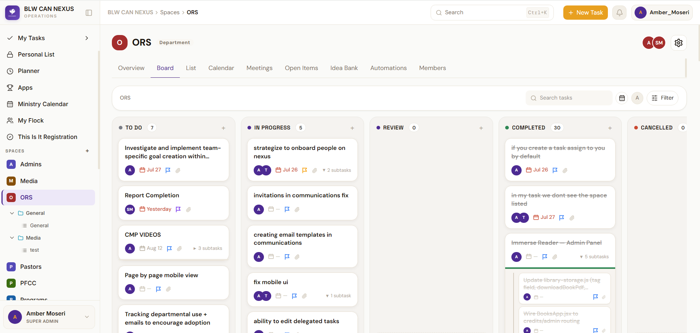
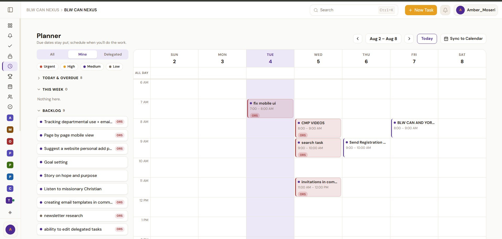

# Nexus — BLW Canada Operations Platform

**Built by one person. Designed for many.**

A production operations platform serving 50 users daily — built to replace ClickUp ($600/month) and architected from day one for volunteer stewardship and organizational handoff. Not just a feature-rich platform, but a demonstration that solo devs can ship systems robust enough for business-critical use.

**Live:** [nexus.lwcanada.org](https://nexus.lwcanada.org)

---

## Quick Links

- **[Maintainer Runbooks](docs/RUNBOOKS.md)** — deployments, incidents, emergency access, and recovery
- **[Architecture Diagram](docs/architecture/NEXUS_ARCHITECTURE.md)** — data flow, relationships, dependencies, and secret boundaries
- **[Features by Team](docs/FEATURES_BY_TEAM.md)** — ownership and escalation map
- **[Local Development Checklist](docs/LOCAL_DEV_SETUP.md)** — verified setup and first-run checks
- **[Code Tour](docs/CODE_TOUR.md)** — 30-minute maintainer walkthrough
- **[Permission Matrix](docs/PERMISSION_MATRIX.md)** — least-privilege access model
- **[Staging and Onboarding](docs/STAGING_AND_ONBOARDING.md)** — volunteer progression and staging baseline
- **[Incident Log](docs/INCIDENTS.md)** — production incident record
- **[Weekly Maintenance Template](docs/WEEKLY_MAINTENANCE_TEMPLATE.md)** — async maintenance update format
- **[Full Feature Catalog](docs/FEATURES.md)** — Complete breakdown of every feature
- **[Architecture Decisions](docs/architecture/decision-catalog.md)** — 35+ design rationales
- **[Security Guidelines](docs/SECURITY.md)** — RLS, JWT, auth patterns
- **[Deployment Guide](docs/deployment/)** — Production setup, migrations, secrets
- **[GitHub](https://github.com/Amber-E-Moseri/Nexus)**

---

## Why It Exists

| | ClickUp Business | Nexus |
|---|---|---|
| ~50 users | $12/user/month = **$600/month** | flat ~**$50/month** |
| Annual | **$7,200/year** | **~$600/year** |
| **Saving** | | **$6,600/year** |

Beyond cost, ClickUp couldn't model BLW Canada's workflows: ministry-scoped meetings, pastor contact management, delegate registration with compliance tracking, or absence notifications. Nexus is purpose-built for each.

---

## How It's Built to Last

This codebase is architected for maintainability by volunteers, not just for launch:

**RLS-First Security** — Access control baked into the database layer, not bolted on. Role-based policies resolve at query time; no leaky authorization logic in the frontend.

**Documented Decisions** — [35+ architecture decisions](docs/architecture/decision-catalog.md) explain the *why* behind every major choice. The next maintainer won't reverse decisions blindly.

**Scoped Code** — Feature modules with clear boundaries. No god components. Dependencies are explicit and documented in [CLAUDE.md](CLAUDE.md).

**Volunteer Onboarding** — [Runbooks](docs/RUNBOOKS.md), [architecture diagrams](docs/architecture/NEXUS_ARCHITECTURE.md), [code tour](docs/CODE_TOUR.md), and a [staging environment](docs/STAGING_AND_ONBOARDING.md) ready for knowledge transfer.

**Production Incident Log** — [Every incident](docs/INCIDENTS.md) is recorded with root cause and fix. Future maintainers learn from past fires.

**Weekly Maintenance Template** — Async format for distributed team updates. Sustainability doesn't mean heroic commits; it means async, written communication.

---

## Tech Stack

| Layer | Technology |
|---|---|
| Frontend | React 18, Vite, React Router v6 |
| UI & Animations | Radix UI, dnd-kit, Framer Motion, Recharts |
| Rich Text | Tiptap (comments, meeting notes) |
| State | React Query (server) + Context (auth, notifications, UI) |
| Backend | Supabase (PostgreSQL + RLS + 25+ Edge Functions) |
| Auth | Supabase Auth + custom token-based invite flow |
| Real-time | Supabase Realtime (`postgres_changes` subscriptions) |
| AI | Anthropic Claude API, Whisper WASM (in-browser transcription), OpenAI TTS (audiobook narration via edge function) |
| Storage | Supabase Storage (PDFs, documents with RLS + IndexedDB caching) |
| Email | Resend (transactional + campaigns with webhooks) |
| External Sync | Google Calendar OAuth, Google Drive, Slack, Outlook, Teams |
| Hosting | Vercel (frontend) + Supabase (backend) |

---

## Key Features

**Task Management** — Kanban/List/Table/Calendar views, two-tier statuses, subtasks, followers, @mentions, dependencies, archive/trash



**Meetings** — Agenda builder, Live Minutes Mode, AI transcription (Whisper WASM), Meeting Docs, PDF export, attendance tracking


**Sprints** — Sprint board, teams, temporary membership, auto-expiration, sprint review  
**Calendar** — Google/Outlook sync, RSVP system, approval queue, event subscriptions  
**Communications** — Email campaigns, advanced segments, A/B testing, bounce tracking, RSVP invitations, analytics  

**Personal Planning** — Today/Tomorrow views, time-blocking planner, Personal List with sublists, Wins tracker



**Flock CRM** — Pastor contact management with role-scoped visibility  

**Registration** — Delegate registration (6 tabs), room assignment, compliance tracking, public sign-up


**Organization** — Org chart (editable), pastoral assignments, department directory, support tickets  
**Dashboard** — Customizable widgets: activity feed, progress, workload, attendance, charts  
**Automations & API** — Rule engine, task REST API (60 req/min), scoped keys  

**Immerse Reader** (`/books`) — AI-powered audiobook reader with:
  - PDF import, AI narration (OpenAI TTS via secure edge function), playback controls
  - Scroll or page-flip viewing modes (swipe navigation, persistent preference)
  - Chapter detection & navigation (Audible-style drawer, desktop sidebar tabs)
  - Highlights, notes, cross-device sync (Supabase metadata + IndexedDB cache)
  - Admin gifting: TTS credit hours (stored as minutes), book sharing with custom tags

**Other** — Regional Updates, BLW CAN Map, Files browser, Growth Tracking  

**→ [Full feature breakdown](docs/FEATURES.md)**

---

## Getting Started (Dev)

### Prerequisites
- Node 20+
- [Supabase CLI](https://supabase.com/docs/guides/cli)

### Local Setup
```bash
git clone <repo-url>
cd clickup
npm install
cp .env.example .env.local    # fill in Supabase URL + anon key
npm run dev                     # http://localhost:5173
```

### Environment Variables
```
VITE_SUPABASE_URL=             # Supabase project URL
VITE_SUPABASE_ANON_KEY=        # Public anon key
VITE_MEETING_OS_URL=           # Embedded Meeting OS URL
```

### Immerse Reader (AI Audiobook)
To enable TTS narration:
1. Get an OpenAI API key from [platform.openai.com](https://platform.openai.com)
2. Set it in Supabase dashboard: **Project Settings → Edge Functions → Secrets**
   - Name: `OPENAI_API_KEY`
   - Value: `sk-...`
3. Edge function `immerse-tts` is auto-deployed; it proxies calls securely (key never exposed to browser)

### Database Setup
1. Create a Supabase project
2. Apply migrations: `supabase db push` (or manually in order from `supabase/migrations/`)
3. Attach JWT hook: Supabase dashboard → Authentication → Hooks → Custom Access Token → `public.custom_access_token_hook`
4. Create first super admin:
   ```sql
   insert into public.users (id, name, email, role, department_id)
   values ('AUTH_USER_ID', 'Admin', 'admin@example.com', 'super_admin', 
           (select id from public.departments where name = 'Admin'));
   ```

### Commands
```bash
npm run dev        # Dev server with hot reload
npm run build      # Production build
npm run preview    # Preview prod build locally
npm test           # Run tests (Vitest)
npm run lint       # ESLint
ANALYZE=true npm run build   # Bundle analysis
```

**Full setup guide:** [docs/setup/](docs/setup/)

---

## Architecture

### RLS-First Security
Every table has Row Level Security enabled. Policies resolve the current user's department and role from JWT custom claims embedded at sign-in. Super admins bypass scoping; everyone else is strictly scoped. Cross-department access uses explicit share tables.

**Roles:**
- `super_admin` — all departments, platform config
- `regional_secretary` — near-super_admin, minus campus photos and permission management
- `dept_lead` — department + sprint management, people invites, automations
- `pastor` — Pastors space, Flock CRM, Registration
- `member` — own department, assigned tasks

### State Architecture
- **Server data → React Query** — stable keys, Realtime invalidations (no polling)
- **Global contexts** — AuthContext, NotificationsContext, InboxCountContext, ToastContext
- **Feature contexts** — TasksContext, SidebarContext (scoped, low in tree)
- **Component state** — everything else

### Database
Core tables: `users` · `spaces` · `folders` · `lists` · `tasks` · `task_comments` · `sprints` · `sprint_members` · `meetings` · `calendar_events` · `communication_campaigns` · `automation_rules` · `flock_contacts` · `registration_delegates` · `api_keys`

**→ [Full DB architecture](docs/architecture/decision-catalog.md)**

---

## Maintenance & Knowledge Transfer

This codebase is designed to be maintained by volunteers. Start here if you're new.

**Getting Oriented**
- [Code Tour](docs/CODE_TOUR.md) — 30-minute walkthrough of core systems
- [Architecture Diagram](docs/architecture/NEXUS_ARCHITECTURE.md) — data flow and relationships
- [Local Development Checklist](docs/LOCAL_DEV_SETUP.md) — verified first-run setup
- [Staging & Onboarding](docs/STAGING_AND_ONBOARDING.md) — how volunteers progress from read-only to commit access

**Making Changes**

**Branch naming:** `feature/*` · `fix/*` · `docs/*` · `refactor/*`

**Commit style:** `feat(module): description` · `fix(module): description`

**Code style:**
- Inline styles only (no Tailwind); design tokens from `src/styles/index.css`
- React hooks, async/await
- Optimistic updates with rollback
- RLS checked in every query
- React Query keys stable and namespaced

**PR expectations:**
- Manual testing on Vercel preview deployment
- Smoke test checklist: sign-in, create task, invite user, trigger automation
- RLS policy review if touching auth/permissions
- No breaking changes to public API without deprecation
- Update [INCIDENTS.md](docs/INCIDENTS.md) if this fixes a known bug

**Testing:** Unit tests for utilities and hooks; end-to-end manual testing on preview.

**Running into a Problem?** Check [Common Issues](#common-issues) or [docs/INCIDENTS.md](docs/INCIDENTS.md) for past fires.

---

## Common Issues

| Problem | Solution |
|---|---|
| JWT hook not attached | Supabase dashboard → Authentication → Hooks → Custom Access Token → `public.custom_access_token_hook` |
| RLS blocking queries | Check JWT claims in token decoder; ensure `user_role` and `user_department_id` are present |
| Migrations won't apply | Run in order; check `supabase/migrations/` naming convention |
| HMR not working | Restart dev server; check Vite config |
| Supabase client undefined | Ensure `.env.local` is filled and dev server restarted |

**→ [Troubleshooting guide](docs/guides/troubleshooting.md)**

---

## MCP Connector (Claude Cowork)

Nexus exposes a stateless MCP endpoint at `https://nexus.lwcanada.org/api/mcp`.

**Setup:** Settings → API → Create key → select `mcp:access` scopes → paste into Claude Cowork as `Authorization: Bearer <key>`

Keys are SHA-256 hashed (shown once). **Regenerate** to rotate; old key stops immediately.

**Required migrations:** `20270806000000_mcp_connector_audit.sql` and `20270806000001_mcp_atomic_meeting_note_append.sql`

**→ [Full MCP guide](docs/MCP_CONNECTOR.md)**

---

## Documentation

**For Maintainers & Volunteers:**
- **[Maintainer Runbooks](docs/RUNBOOKS.md)** — Deployments, incidents, emergency access, recovery procedures
- **[Code Tour](docs/CODE_TOUR.md)** — 30-minute guided walkthrough of core systems
- **[Local Development Checklist](docs/LOCAL_DEV_SETUP.md)** — Verified setup and first-run checks
- **[Architecture Diagram](docs/architecture/NEXUS_ARCHITECTURE.md)** — Data flow, relationships, dependencies
- **[Staging & Onboarding](docs/STAGING_AND_ONBOARDING.md)** — Volunteer progression and baseline environment
- **[Incident Log](docs/INCIDENTS.md)** — Production incident record with root causes
- **[Weekly Maintenance Template](docs/WEEKLY_MAINTENANCE_TEMPLATE.md)** — Async maintenance update format
- **[Permission Matrix](docs/PERMISSION_MATRIX.md)** — Least-privilege access model

**For Developers & Contributors:**
- **[DECISIONS.md](DECISIONS.md)** — Recent feature decisions (August 2026+)
- **[docs/FEATURES.md](docs/FEATURES.md)** — Exhaustive feature catalog with every setting, widget, integration
- **[docs/architecture/decision-catalog.md](docs/architecture/decision-catalog.md)** — 35+ design rationales and trade-offs
- **[docs/SECURITY.md](docs/SECURITY.md)** — RLS, JWT, auth patterns
- **[docs/deployment/](docs/deployment/)** — Production setup + checklists
- **[docs/guides/](docs/guides/)** — Testing, troubleshooting, verification

---

## Contact & Support

**Maintainer:** Amber Moseri · [github.com/Amber-E-Moseri/Nexus](https://github.com/Amber-E-Moseri/Nexus)  
**Issues & Features:** [GitHub Issues](https://github.com/Amber-E-Moseri/Nexus/issues)

---

*Internal use — BLW Canada Sub-Region*
